# 从零搭建个人 Hexo 博客

## 前置环境搭建

### 安装 `Node.js` 和 `git` 

- 根据自己的操作系统下载对应的安装包，进行安装
  - [NodeJS下载地址](https://nodejs.org/en/download/) 
  - 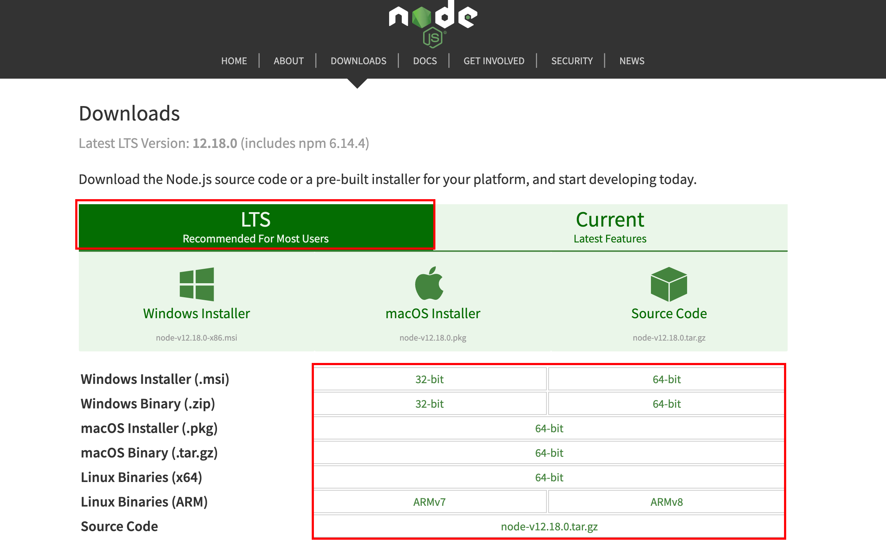
  - [Git下载地址](https://git-scm.com/downloads) 
  - 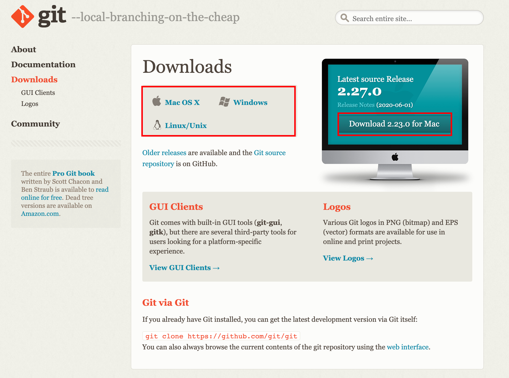
- 检查安装是否成功
  - 打开终端，分别输入 `node -v` 和 `git --version` ；正常输出版本则表示安装成功
  - 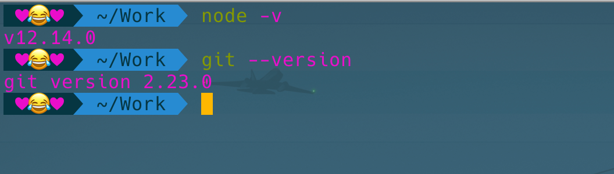
  - **Windows系统如果安装后，不成功；可能需要系统配置环境变量**

### 安装 Hexo 

- 使用以下命令进行安装即可 【 [Hexo官网](https://hexo.io/zh-cn/) 】

  ```bash
  npm install hexo-cli -g
  ```

  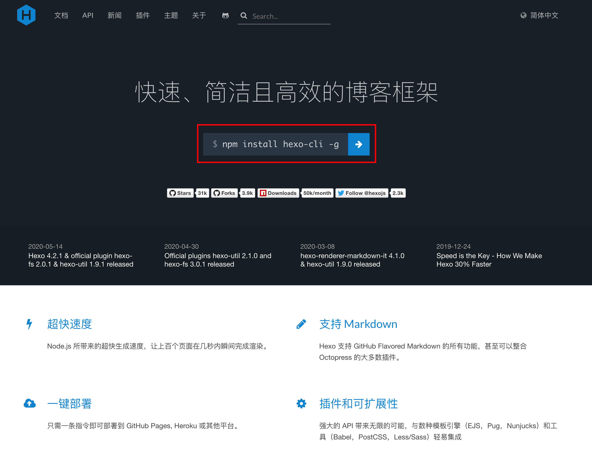

- 检查安装是否成功
  - 在终端输入 `hexo v` ；正常输出版本则表示安装成功
  - 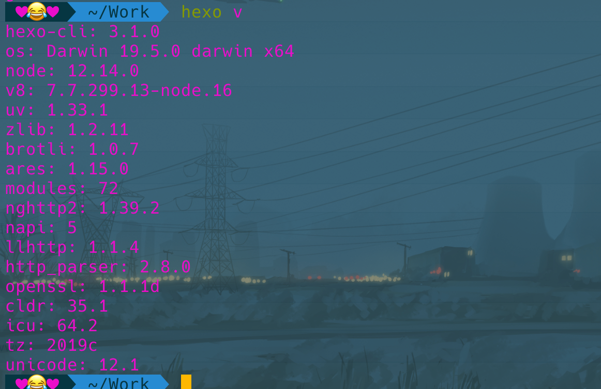

> 至此，我们的前置基础环境配置完成。
>
> 接下来，我们就开始正式搭建博客

## Hexo 博客搭建

### 初始化项目

- 找一个喜欢的目录，创建一个 `Blog` 文件夹

- 使用 `hexo init .` 初始化一个项目

  ```bash
  mkdir Blog && cd Blog
  
  hexo init .
  ```

### 预览我们的博客

完成上面的操作后，我们的博客基本上已经搭建完成，并且我们可以本地预览和编写文章了。

- 本地预览

  - ```bash
    hexo s
    ```

  - 打开浏览器，在地址栏输入： `http://localhost:4000/` ，这是就能看到我们的博客了

  - 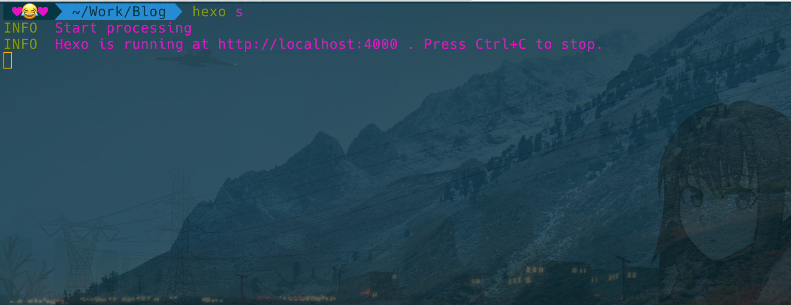

  - 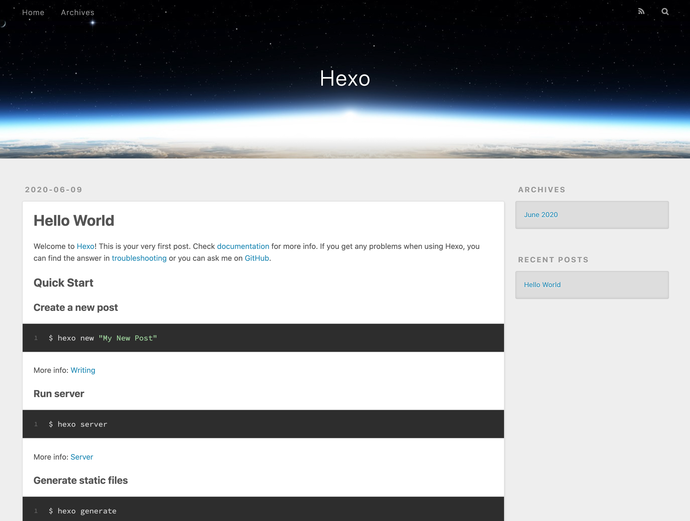

但是我们也发现了几个问题：

1、我们的博客默认主题不太好看

2、我们的文章只能自己本地预览，别人无法看到我们的文章

所以接下来，我们就要解决以上两个问题

## 部署博客

### 注册 码云(Gitee) 账号

- 注册账号，注册成功后登陆，找到个人设置

- 添加一个 SSH公钥，方便后期的操作

- 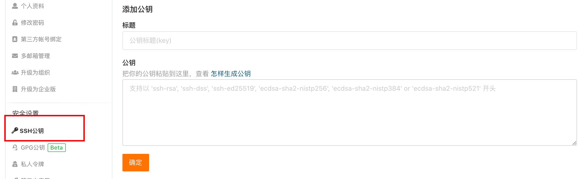

- 我们的公钥文件在 `~/.ssh/id_rsa.pub` 文件；我们可以使用 `cat` 命令来进行查看

  ```bash
  cat ~/.ssh/id_rsa.pub 
  ```

- 如果文件不存在，我们可以使用如下命令进行生成

  ```bash
  ssh-keygen -t rsa -C '邮箱地址'
  ```

### 部署项目

- 创建一个新的仓库，以自己的用户名命名

- 在我们的本地博客项目中配置部署信息；使用 `VSCode` 打开我们博客根目录下的 `_config.yml` 文件；把文件末尾的 `de` 节点替换为如下内容

  ```yaml
  deploy:
    type: 'git'
    repo: 
      gitee: '项目地址'
    branch: master
  ```

- 安装 git 部署插件

  ```bash
  yarn add hexo-deployer-git 
  ```

- 配置自定义部署命令

  打开项目根目录下的 `package.json` 文件，在 `scripts` 下添加以下命令

  ```json
  "pub": "hexo clean && hexo g && hexo d"
  ```

  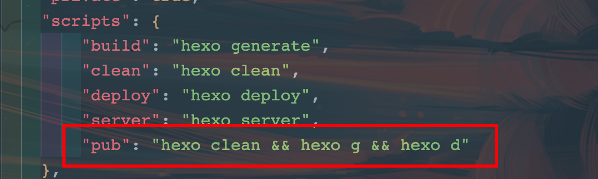

- 运行以下命令进行博客部署

  ```bash
  yarn pub
  ```

  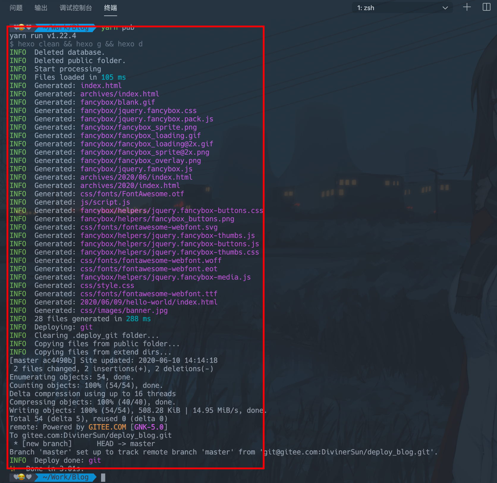

- 打开Gitee中我们的项目， 找打 `服务 -> Gitee Pages` 

  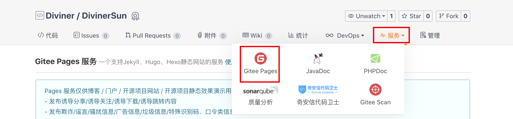

- 选择对应的分支，并点击 *启动* 

  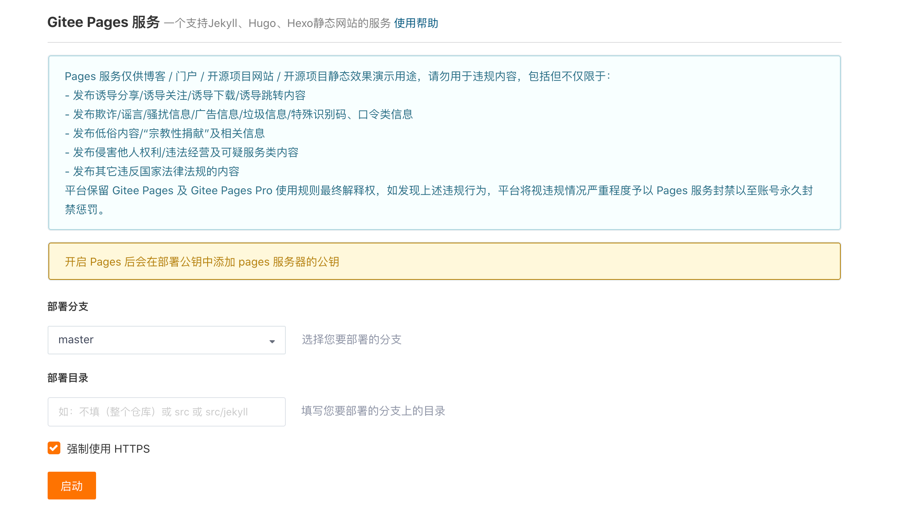

- 等待一会， 就会给你返回一个博客地址， 点击就可以访问我们的博客了

  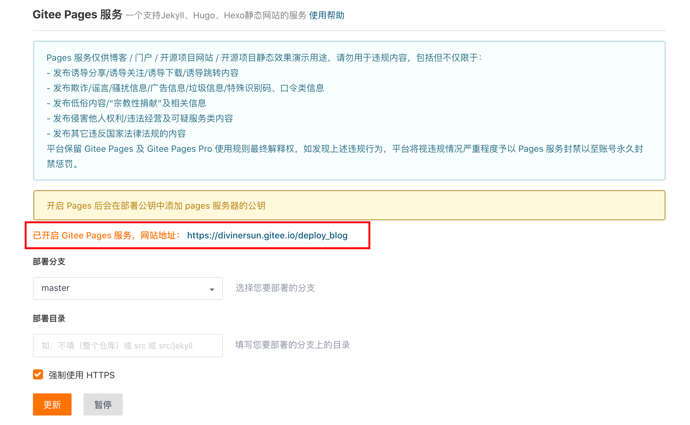

## 博客主题

