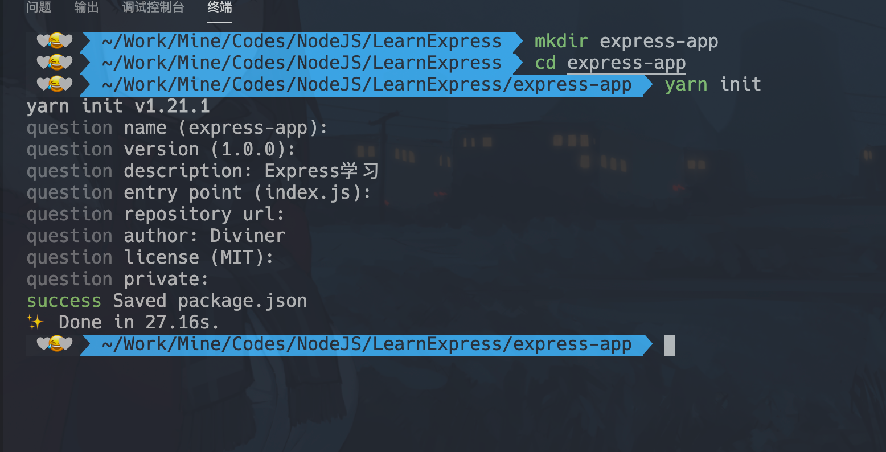
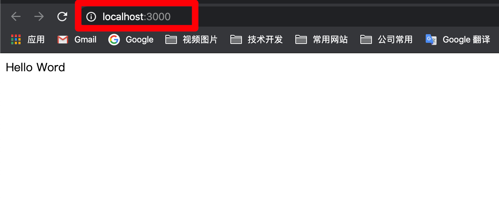
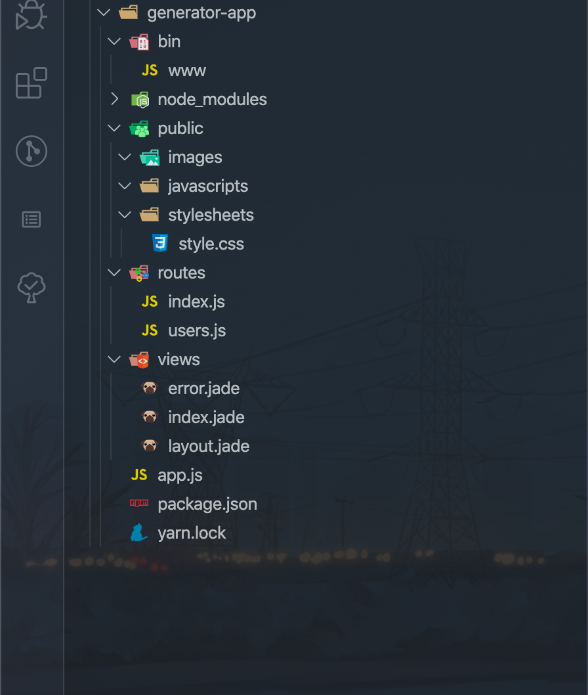

# Express简介和快速入门

### Express简介

`Express`是基于`Node.js` 的Web框架；根据官网描述，其特点是：快速、开放、极简

- 使用方式

  ```sh
  npm install express --save
  ```

- 官网概述如下图：

  

### Express快速入门

- 安装

  Express是Node.js的Web框架，所以使用前，必须确保自己已经安装了Node。

  - 使用以下命令检查是否已经安装Node，如果没有安装请自行安装，[Node官网](https://nodejs.org/en/) 

  ```sh
  node -v
  ```

  - 接下来创建一个文件夹作为我们的项目目录，之后进入创建的文件夹并进行初始化

    ```sh
    # 操作命令如下
    
    # 第一步：创建文件夹
    mkdir express-app
    # 第二步：进入文件夹
    cd express-app
    # 第三步：初始化项目(使用 npm 和 yarn 都可以)
    npm init
    yarn init
    # 以上命令使用任意一个即可，之后填写相应的初始化信息，也可以啥也不写，按照默认一直回车即可
    ```

    

  - 安装 Express

    ```sh
    yarn add express
    # 或者
    npm install express --save
    ```

- 第一个Express程序

  - 首先我们在项目目录下创建一个 `index.js` 的文件，然后按照国际惯例，编写一个 **Hello World** 程序，代码如下：

    ```javascript
    const express = require('express')
    const app = express()
    
    app.use('/', (req, res) => {
        res.send('Hello Word')
    })
    
    app.listen(3000, () => {
        console.log('The server listening on prot 3000!\n Server address: http://localhost:3000 ')
    })
    ```

  - 运行代码，打开浏览器查看结果  *http://localhost:3000/* 

    ```sh
    node index.js
    ```

    

- Express生成器

  Express程序生成器是让我们快速创建一个Express应用的脚手架工具，它会帮我们初始化一部分项目的目录结构和文件

  - 安装方式

    我们可以通过全局安装的方式进行安装，然后使用 ***express*** 来创建项目；也可以使用Node自带的 **npx** 命令进行创建项目(推荐)

    ```sh
    # 全局安装创建
    npm install -g express-generator
    express generator-app
    
    # npx方式创建
    npx express-generator generator-app
    ```

  - 安装依赖

    ```sh
    cd generator-app
    
    # npm 安装
    npm install
    
    # yarn 安装
    yarn
    ```

  - 运行项目

    ```sh
    # MacOS 和 Linux
    DEBUG=generator-app:* npm start
    DEBUG=generator-app:* yarn start
    
    # Windows
    set DEBUG=generator-app:* & npm start
    set DEBUG=generator-app:* & yarn start
    
    # 不加 DEBUG 设置也可以直接运行
    ```

  - 项目目录

    

- Express基本路由

  路由是为了确定应用程序如何响应客户端对特点端点的请求，该特定端点是URI(或路径)和特定的HTTP请求方法(GET、POST等)

  每一个路由具有一个或多个处理函数，这些函数只有在路由匹配是才执行

  - 路由定义的格式

    - ***app***：express的实例
    - ***METHOD***：小写的 HTTP 请求方法
    - ***PATH***：服务的请求地址
    - ***HANDLER***：路由匹配时的执行函数

    ```javascript
    app.METHOD(PATH, HANDLER)
    # eg:
    app.get('/', () => {})
    ```

  - 接下来我们使用第一次创建的 *express-app* 项目进行代码实践

  - 示例代码：

    ```javascript
    const express = require('express')
    const app = express()
    
    // app.use('/', (req, res) => {
    //     res.send('Hello Word')
    // })
    
    app.get('/', (req, res) => {
        res.send('<h1>Hello Express</h1>')
    })
    
    app.get('/', (req, res) => {
        res.send('我是POST请求')
    })
    
    app.get('/user', (req, res) => {
        res.send({
            name: 'Diviner',
            code: 3,
            gender: '男'
        })
    })
    
    app.listen(3000, () => {
        console.log('The server listening on prot 3000!\n Server address: http://localhost:3000 ')
    })
    ```

- Express静态文件处理

  Express中使用 `exporess.static()` 这个内置的中间件函数可以配置静态文件的处理方式

  - 使用方式：

    - ***root***：静态资源存放的根目录
    - ***options***：对静态文件的一些约束条件，可选参数

    ```javascript
    express.static(root, [options])
    
    # 以 public 为静态资源文件夹
    app.use(express.static('public'))
    
    
    # 在实际开发中使用如下方式
    app.use('/static', express.static(path.join(__dirname, 'public')))
    ```

  - 具体示例代码：

    在项目根目录下创建`public/images` 文件夹， 然后复制一张图片到 images 文件夹下

    启动项目： *node index.js* 

    打开浏览器，地址栏输入 **http://localhost:3000/static/images/index.png** 即可看到图片

    ```javascript
    const path = require('path')
    const express = require('express')
    const app = express()
    
    app.use('/static', express.static(path.join(__dirname, 'public')))
    
    app.listen(3000, () => {
        console.log('The server listening on prot 3000!\n Server address: http://localhost:3000 ')
    })
    ```

    

