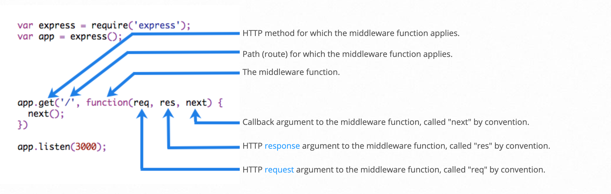
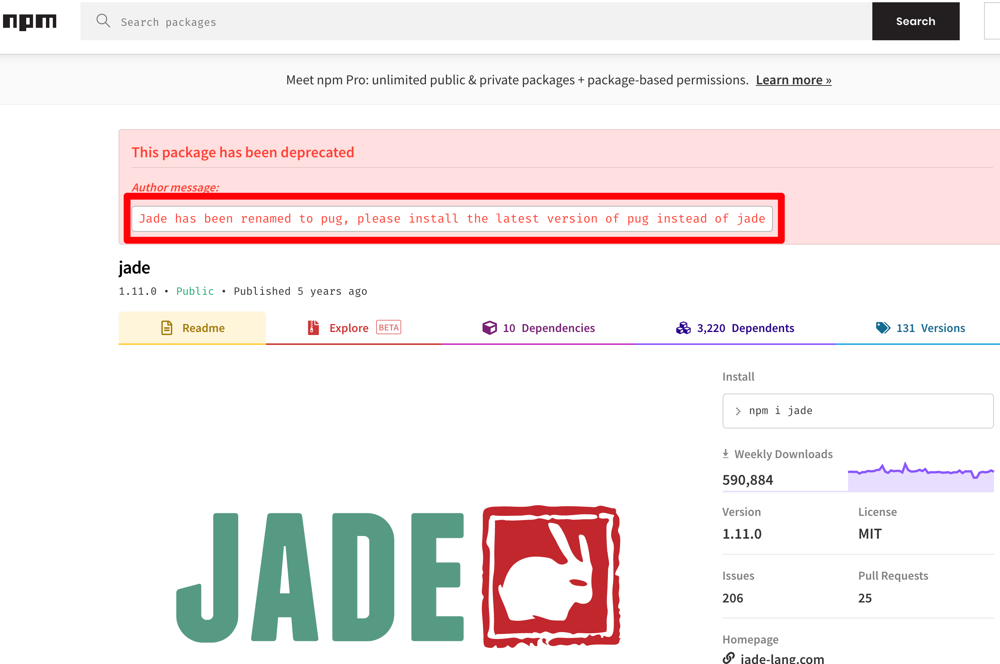
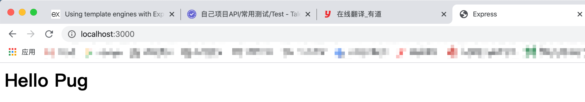
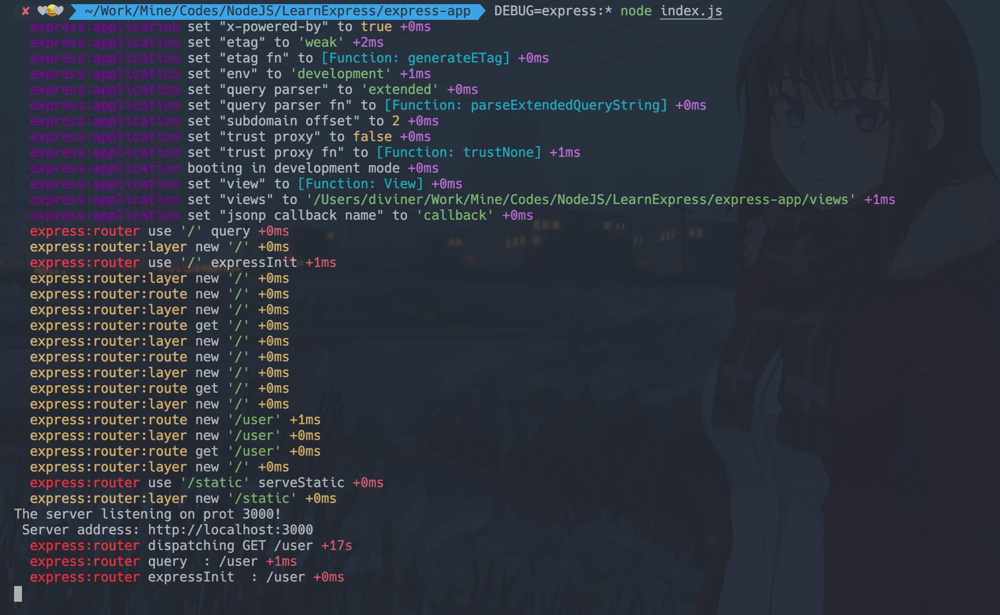

# Express指南

### 路由

- **路由方法** 

  路由方法是从HTTP方法之一派生出来的，并附加到了Express类的实例

  以下是`Express`中路由方法的示例代码

```javascript
const express = require('express')
const app = express();


const result = {
    method: 'GET',
    path: '/',
    status: 'SUCCESS',
    data: 'Hello'
}


// GET 方法
app.get('/', (req, res) => {
    res.send(result);
})

// POST 方法
app.post('/', (req, res) => {
    result.method = 'POST'
    res.send(result);
})

app.listen(3000, () => {
    console.log('This server running port 3000')
})
```

​		Express提供了一个方法用于为所有的请求方法路径上添加中间件，这个方法是：`app.all()`。

​		以下代码，不管使用HTTP的任何一个方法进行请求，都会执行：

```javascript
app.all('/test', (req, res, next) => {
    result.method = req.method
    res.send(result)
    next()
})
```

- **路由路径** 

  路由路径与请求方法结合，定义了可以发出请求的端点。路由路径可以是字符串或正则表达式

  如果需要在路径中使用 `$` 符号， 这需要进行转义操作；格式：([\\&])。

```javascript
# 想要如下路径
'/users/$user/view'
# 应该写成
'/users/([\$])user/view'
```

- **路由参数** 

  路由参数被命名为URL段，用于捕获URL中在其位置上指定的值；捕获的值将填充到 `req.params` 对象中，并且会将路径中指定的路由的参数名称作为各自的键。

  ```javascript
  app.get('/users/:userId/view', (req, res) => {
      res.send({path: req.path, params: req.params})
  })
  
  app.get('/users/:userId/books/:bookId', function (req, res) {
      res.send({path: req.path, params: req.params})
  })
  ```

- **路由处理程序** 

  路由处理程序可以采用函数、函数数组或两者的组合方式

  - 单个函数方式示例

    ```javascript
    // 单个函数
    app.get('/users/:id/view', (req, res) => {
        res.send(req.params)
    })
    ```

  - 多个函数方式示例

    ```javascript
    // 多个函数
    app.get('/users/:id/edit', (req, res, next) => {
        next()
        res.send(req.params)
    }, (req, res) => {
        console.log('这是第二个处理函数', req.path)
    })
    ```

  - 数组方式示例

    ```javascript
    // 数组处理
    const arr1 = (req, res, next) => {
        console.log('数组处理函数一', req.path)
        next()
    }
    const arr2 = (req, res, next) => {
        console.log('数组处理函数二', req.path)
        next()
    }
    const arr3 = (req, res) => {
        console.log('数组处理函数三', req.path)
        res.send(req.path)
    }
    
    # 数组是按顺序进行执行的，如果将 arr3 放在前面，则后面的就不会执行
    # 原因：arr3 并没有指定 next 函数
    app.get('/users/arrays', [arr1, arr2, arr3])
    ```

- **响应方法** 

  响应对象(`res`)可以向客户端发送响应，并终止 *响应-请求* 周期。响应对象包含如下方法

  |       方法       |                        描述                        |
  | :--------------: | :------------------------------------------------: |
  |  res.download()  |                    提示下载文件                    |
  |    res.end()     |                    结束响应进程                    |
  |    res.json()    |                    发送JSON响应                    |
  |   res.jsonp()    |              发送支持JSONP的JSON响应               |
  |  res.redirect()  |                   重定向一个请求                   |
  |   res.render()   |                  渲染一个视图模板                  |
  |    res.send()    |                 发送各种类型的响应                 |
  |  res.sendFile()  |              将文件作为八位字节流发送              |
  | res.sendStatus() | 设置响应状态码，并将其字符串表示形式发送为响应正文 |

- **app.route()**

  通常我们可以使用 `app.route()` 来创建请求地址相同，请求方法不同的链式路由，以下是示例代码

  ```javascript
  app.route('/user')
  // POST 增加
  .post((req, res) => {
      res.send('创建一个用户')
  })
  // DELETE 删除
  .delete((req, res) => {
      res.send('删除一个用户')
  })
  // PATCH 修改
  .patch((req, res) => {
      res.send('修改一个用户')
  })
  // GET 查询
  .get((req, res) => {
      res.send('查询一个用户')
  })
  ```

- **express.Router** 

  通过使用 `express.Router()` 可以创建模块化的可安装路由处理程序；每一个路由的实例都是一个完整的中间件和路由系统、简单使用示例代码

  创建 `router.js` 文件：

  ```javascript
  const express = require('express')
  const app = express()
  const users = require('./userRouter')
  
  
  app.use('/users', users)
  
  app.listen(3000, () => {
      console.log('This server running port 3000')
  })
  ```

  创建 `userRouter.js` 文件：

  ```javascript
  const express = require('express')
  const router = express.Router()
  
  
  router.get('/:id/view', (req, res) => {
      res.send({
          method: req.method,
          path: req.path,
          params: req.params,
          data: {
              status: 'SUCCESS',
              message: '用户查询成功',
              user: {
                  id: req.params.id,
                  name: 'Diviner',
                  age: 18,
                  gender: '男'
              }
          }
      })
  })
  
  router.patch('/:id/edit', (req, res) => {
      res.send({
          method: req.method,
          path: req.path,
          params: req.params,
          data: {
              status: 'SUCCESS',
              message: '用户信息更新成功',
              user: {
                  id: req.params.id,
                  name: '先知',
                  age: 18,
                  gender: '男'
              }
          }
      })
  })
  
  router.delete('/:id/del', (req, res) => {
      res.send({
          method: req.method,
          path: req.path,
          params: req.params,
          data: {
              status: 'SUCCESS',
              message: '用户删除成功',
              user: {}
          }
      })
  })
  
  router.post('/create', (req, res) => {
      res.send({
          method: req.method,
          path: req.path,
          params: req.params,
          data: {
              status: 'SUCCESS',
              message: '新用户创建成功',
              user: {
                  id: 121,
                  name: 'Diviner',
                  age: 18,
                  gender: '男'
              }
          }
      })
  })
  
  module.exports = router
  ```

  最后运行 `router.js` 文件：

  ```sh
  node router.js
  ```

  打开浏览器输入： *http://localhost:3000/users/1/view* 查看结果，**请注意完整的请求路径** 

  ***注意：浏览器只能查看GET方法， 其他的方法需要借助与RESTFul API请求模拟工具来测试*** 

  ***工具推荐：[Talend API Tester - Free Edition( 谷歌浏览器插件)](https://chrome.google.com/webstore/detail/talend-api-tester-free-ed/aejoelaoggembcahagimdiliamlcdmfm) 和  [POSTMAN](https://www.postman.com/downloads/)***

- 

### 编写中间件

- **总览** 

  中间件的功能是可以访问 `请求对象(req)`、`响应对象(res)` 和应用程序 `请求-响应周期` 中的 `next()` 函数。 这个 *next* 是 Express 路由中的一个函数，在当前中间件被执行成功后执行

  中间件函数可以执行以下功能：

  - 执行任意代码
  - 更改请求和响应对象
  - 结束 请求-响应 周期
  - 调用堆栈中的下一个中间件

  *如果当前中间件函数没有结束 请求-响应 周期，则它必须调用 `next()` 将控制权传递给下一个中间件函数。否则，该请求将被挂起* 

  下图展示了中间件函数调用的元素：

  

  **中间件使用 `app.use()` 来进行使用， 而且中间件的执行是按照加载的顺序来执行的，所以中间件加载的顺序是很重要的** 

- 

### 使用中间件

Express是一个路由和中间件Web框架，其自身的功能很少；Express应用程序本质上是一系列中间件函数的调用

Express应用程序可以使用以下类型的中间件：

- **应用程序级别中间件** 

  通过使用 `app.use()` 和 `app.METHOD()` 函数将应用程序级中间件绑定到app对象的实例，其中 METHOD 是中间件函数处理 HTTP 请求的方法(小写)

- **路由级别中间件** 

  路由级别的中间件的工作方式与应用程序级别的中间件相同，只不过它是绑定到 `express.Router()` 对象的实例上而已。例如我们前面编写的 userRouter

- **错误处理中间件** 

  错误处理中间件始终采用`四个参数`，必须提供四个参数将其标识为错误处理中间件。即使你不需要使用 `next` 也必须指定它来维护签名。否则，`next`将被解释为常规的中间件，并且将无法处理错误

  ```javascript
  app.use((err, req, res, next) => {
      console.log('程序出错', err)
      res.status(500).send({code: 5000, message: '请求错误'})
  })
  ```

- **内置中间件** 

  Express具有以下内置的中间件功能：

  - **express.static()**：提供静态资源，例如HTML文件、图像等
  - **express.json()**：使用JSON的格式解析传入的请求，4.16及以上版本可以使用
  - **express.urlencoded**：使用URL编码的方式解析传入的请求，4.16及以上版本可以使用

- **第三方中间件** 

  使用第三方中间件可以增加Express应用程序的功能

  例如使用 `cookie-parser` 

  ```sh
  # 安装
  npm install cookie-parser --save
  # 或者
  yarn add cookie-parser
  ```

  ```javascript
  // 使用中间件
  var express = require('express')
  var app = express()
  var cookieParser = require('cookie-parser')
  
  // 加载中间件
  app.use(cookieParser())
  ```

### 使用模板引擎

模板引擎可以使应用程序中使用静态的模板文件。在运行时，模板引擎用实际值替换模板文件中的变量，并将模板转换为发送个客户端的HTML文件。通过这种方法使得设计HTML页面更加的容易

Express脚手架工具默认使用 **[jade](http://expressjs.jser.us/jade.html)** 作为默认的模板引擎；但我们常用的模板引擎还有 **[ejs](https://ejs.co/)**、**[mustache](https://github.com/janl/mustache.js)** 和 **[pug](https://pugjs.org/api/getting-started.html)** 

我们在 npm 市场查看 jade， 提示我们其已经被 pug 代替， 所以我们使用 pug或其他两个模板引擎即可



下面我们以 `pug` 模板引擎进行演示：

- **使用 `express-generator` 创建一个项目** 

  ```sh
  npx express-generator generator-app
  ```

- **安装 *pug* 模板引擎** 

  ```sh
  cd generator-app
  yarn add pug
  ```

- **修改代码**：

  ```javascript
  // app.js
  // 将下面代码
  app.set('view engine', 'jade');
  // 修改为
  app.set('view engine', 'pug');
  
  
  
  // routes/index.js
  // 将下面代码
  /* GET home page. */
  router.get('/', function(req, res, next) {
    res.render('index', { title: 'Express' });
  });
  // 修改为
  /* GET home page. */
  router.get('/', function(req, res, next) {
    res.render('index', { title: 'Express', message: 'Hello Pug' });
  });
  ```

- **创建pug模板文件** 

  ```pug
  // views目录下创建文件：index.pug, 写入以下代码
  html
      head
          title= title
      body
          h1= message
  ```

- **启动项目查看结果** 

  ```sh
  # 启动项目
  yarn start
  ```

  浏览器输入：*http://localhost:3000/* 看到如下效果则说明使用成功

  

  

### 错误处理

`错误处理`是指Express如何捕获和处理同步和异步发生的错误。 Express默认带有错误处理程序，故此我们无需编写就可以使用

- **捕获错误** 

  确保Express能够捕获运行路由处理程序和中间件时发生的所有错误很重要

  路由处理程序和中间件内部的同步代码中发生的错误不需要任何额外的工作。如果同步代码发生错误Express会捕获并且处理它

  ```javascript
  app.get('/', (req, res) => {
      throw new Error('出错了！')
  })
  ```

  对于从路由处理程序和中间件调用的`异步函数`返回的错误，必须将其传递给 `next()` 函数，Express将在该函数中捕获并处理它们

  ```javascript
  app.get('/', (req, res, next) => {
      fs.readFile('./not_exist.txt', (err, data) => {
          if (err) {
              next(err)
          } else {
              res.send(data)
          }
      })
  })
  ```

- **默认的错误处理程序** 

  Express带有内置的错误处理程序，可处理应用程序中可能遇到的任何错误。该默认的错误处理中间件功能添加在中间件功能堆栈的末尾。

  如果将错误传递给 *next()* 并且未在自定义错误处理程序中进行处理，则它将由内置错误处理程序进行处理；错误将与堆栈跟踪一起写入客户端。堆栈跟踪不包括在生产环境中

- **编写错误处理程序** 

  定义错误处理中间件功能的方式与其他中间件功能相同，不同之处在于错误处理功能具有四个参数而不是三个参数：(err, req, res, next)

  简单示例：

  ```javascript
  app.use((err, req, res, next) => {
    console.error(err.stack)
    res.status(500).send('服务异常!')
  })
  ```

  错误处理应该定义在其他 *app.use()* 中间件或者路由之后

### 调试Express程序

Express在内部使用调试模块记录有关路由匹配，正在使用的中间件功能，应用程序模式以及请求-响应周期流的信息。

想要启用调试程序来查看Express中使用的所有内部日志，我们需要启动项目是指定为 **DEBUG模式** 

```sh
# MacOS 和 Linux
DEBUG=express:* node index.js

# Windows
set DEBUG=express:* & node index.js
```



### 数据库整合

- **MySQL** 

  - 模块名称：`mysql` 

  - 模块安装

    ```sh
    npm install mysql
    
    yarn add mysql
    ```

  - 示例代码

    ```javascript
    const mysql = require('mysql')
    
    
    // 创建数据库连接对象
    const connection = mysql.createConnection({
        host: 'localhost',      // 主机地址
        user: 'root',           // 数据库用户
        password: 'root123456', // 数据库密码
        database: 'test',       // 数据库名称
    })
    
    // 连接数据库
    connection.connect(err => {
        if (!err) {
            console.log('数据库连接成功！')
        } else {
            console.log('数据库连接失败', err)
        }
    })
    
    // 查询操作
    connection.query('select * from user_infos', (err, rows, fields) => {
        if (err) {
            throw new Error('数据查询失败！')
        }
    
        console.log('rows: ', rows)
    })
    
    
    // 关闭连接
    connection.end()
    ```

- **MongoDB** 

  - 模块名称：`mongodb` 

  - 模块安装

    ```sh
    npm install mongodb
    
    yarn add mongodb
    ```

  - 示例代码

    ```javascript
    const mongoClient = require('mongodb').MongoClient
    
    
    
    mongoClient.connect('mongodb://localhost:27017/users', (err, client) => {
        if (err) {
            throw err
        }
    
        const db = client.db('users')
    
        db.collection('users').find().toArray((err, result) => {
            if (err) {
                console.log('查询出错！')
                throw err
            }
    
            console.log('result: ', result)
        })
    })
    ```

- **Redis** 

  - 模块名称：`redis` 

  - 模块安装

    ```sh
    npm install redis
    
    yarn add redis
    ```

  - 示例代码

    ```javascript
    var redis = require('redis')
    var client = redis.createClient()
    
    client.on('error', function (err) {
      console.log('Error ' + err)
    })
    
    client.set('string key', 'string val', redis.print)
    client.hset('hash key', 'hashtest 1', 'some value', redis.print)
    client.hset(['hash key', 'hashtest 2', 'some other value'], redis.print)
    
    client.hkeys('hash key', function (err, replies) {
      console.log(replies.length + ' replies:')
    
      replies.forEach(function (reply, i) {
        console.log('    ' + i + ': ' + reply)
      })
    
      client.quit()
    })
    ```

